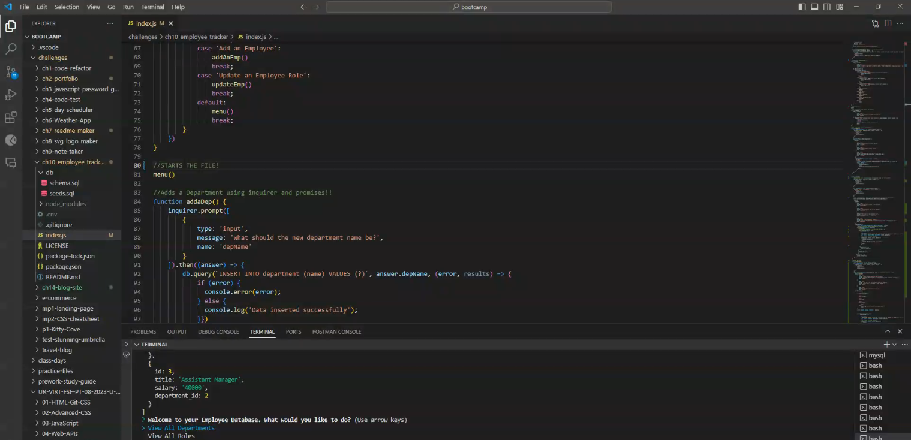

# Employee Database

## Description

This is a rudementary database for employees made with mySQL. You can create departments, roles, add employees, and update employees. I created this project in order to practice my knowledge of MySQL databases. This project really challenged my knowledge of inquirer prompts and mysql.
    
## Table of Contents

- [Installation](#Installation)
- [Usage](#Usage)
- [License](#License)
- [Contributing](#Contributing)
- [Tests](#Tests)
- [Questions](#Questions)
    
## Installation

The user can install this app by cloning the repo to your computer.

## Usage
    
In order to use this application, you can open the index.js in the terminal and run node index. You will get a menu of options to choose from.

[Video Link]()

## License

This project is covered under the MIT license. For more information, visit the link below.

[License Link](./LICENSE)

## Contributing

This is a challenge from the edX bootcamp, I will not accept contributions for this project.
    
## Tests

This application has no tests at this time.
    
## Questions

Have any questions? This is how to contact me:

Github: https://github.com/RuckusEnjoyer

    